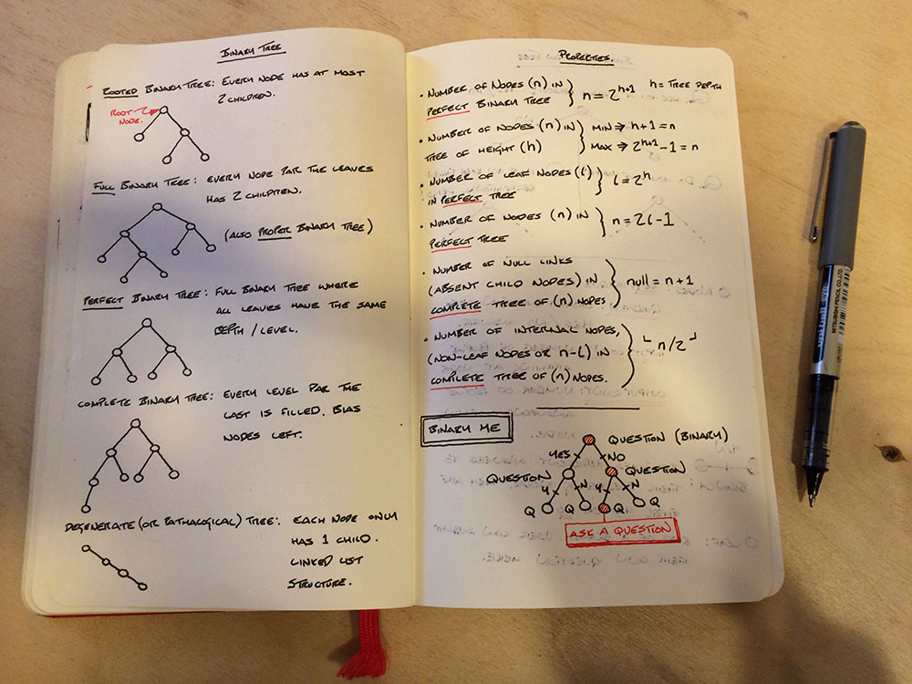

# Initial Research

Binary Trees are data structures used for efficient searching and sorting. Their structure is often composed by intelligent systems to facilitate the performance of these algorithms.

*—sketches visualising different binary tree structures*

## Terminology & Properties

Binary Trees consist of 2 components: **[node]s** and **[branch]es**.

* A **node** is an abstract entity—commonly associated with an entry in a database.
  - A node in a binary tree can have *no more than 2 child nodes*.
  - A **root** node refers to the node at the *base or origin* of a tree.
  - A **leaf** node is a node with *no child nodes*. leaf nodes are always found at the *tips of branches*.
* A **branch** *connects* 2 nodes.
