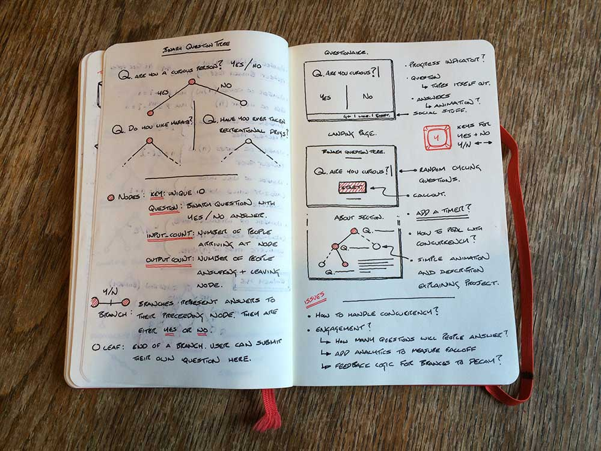

# Data Collection

*—designing the node data structure and questionaire interface*

## Technologies & Approach

Google App Engine will be used for the backend—providing both a datastore and API which the front–end can interact with.
Angular.js will be used on the front–end to update the interface as the participant progresses through the questionaire.
